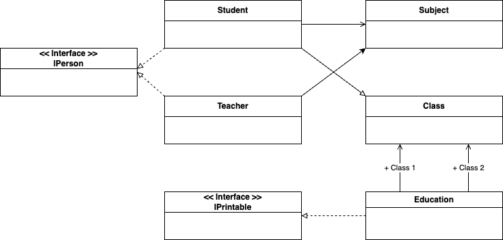
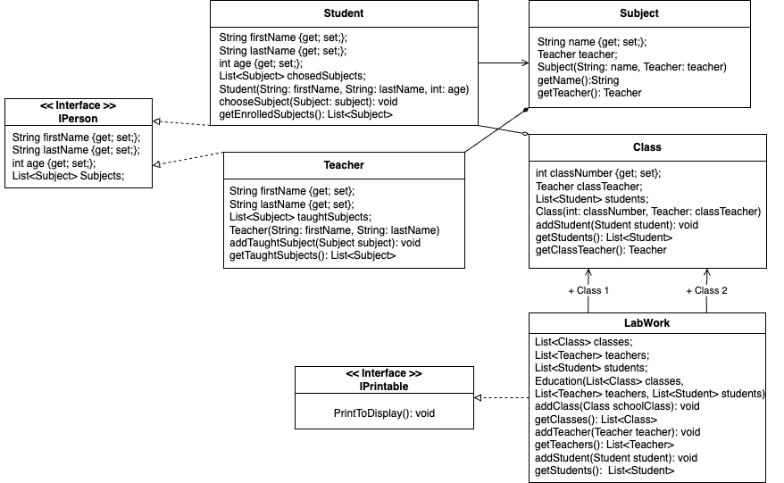

# Проєкт частина А
з дисципліни Об’єктно орієнтоване програмування  
на тему: Відношення між класами: асоціація, агрегація, композиція, реалізація

## Опис предметної області 
&nbsp; &nbsp;&nbsp; Шкільна система розроблена для управління навчальним процесом у навчальному закладі. Система включає в себе основні об'єкти та взаємодії між ними, які відображають типові аспекти навчання та організації шкільного життя.
Об'єкти системи:  
*Учень:*
-	Властивості: Ім'я, прізвище, вік.
-	Взаємодія: Учень може вивчати кілька предметів.  
**Предмет:**
-	Властивості: Назва предмету.
-	Взаємодія: Предмет може мати викладача та бути вивченим декількома учнями.  
*Клас (Група учнів):*
-	Властивості: Список учнів, класний керівник.
-	Взаємодія: Клас складається з учнів та має класного керівника.  
*Вчитель:*
-	Властивості: Ім'я, прізвище.
-	Взаємодія: Вчитель може вести декілька предметів та мати список учнів.  
**Відносини між об'єктами:**  
*Асоціація:*
-	Учень та Предмет: Учень асоційований з предметом, оскільки може вивчати кілька предметів.  
*Агрегація:*
-	Клас та Учень: Клас агрегує учнів, оскільки клас складається з учнів.  
*Композиція:*
-	Розклад та Предмет: Розклад використовує композиційне відношення з предметом, оскільки розклад може визначати конкретні предмети.  

Ця шкільна система дозволяє ефективно керувати інформацією про учнів, вчителів, предмети та їх взаємодії, сприяючи організації навчання в навчальному закладі.

## Проєктування діаграми класів

**Виявлення та визначення елементів предметної області та зв’язки між ними**

**Детальне проєктування елементів моделі предметної області**
